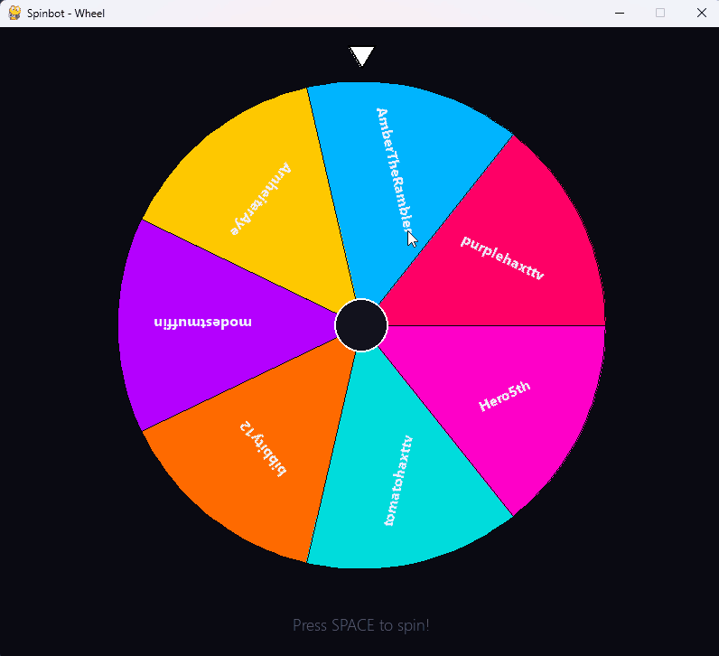
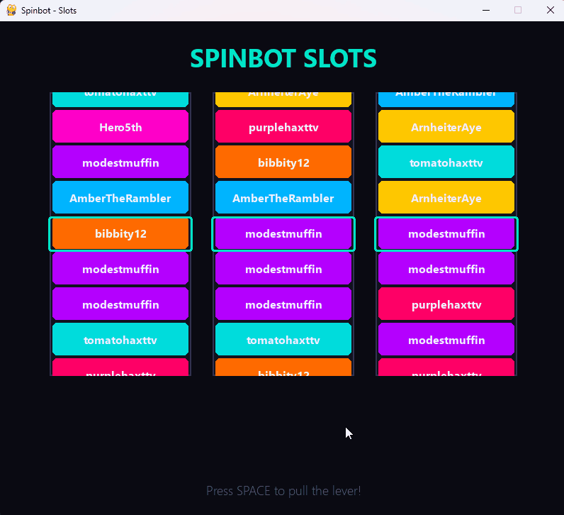
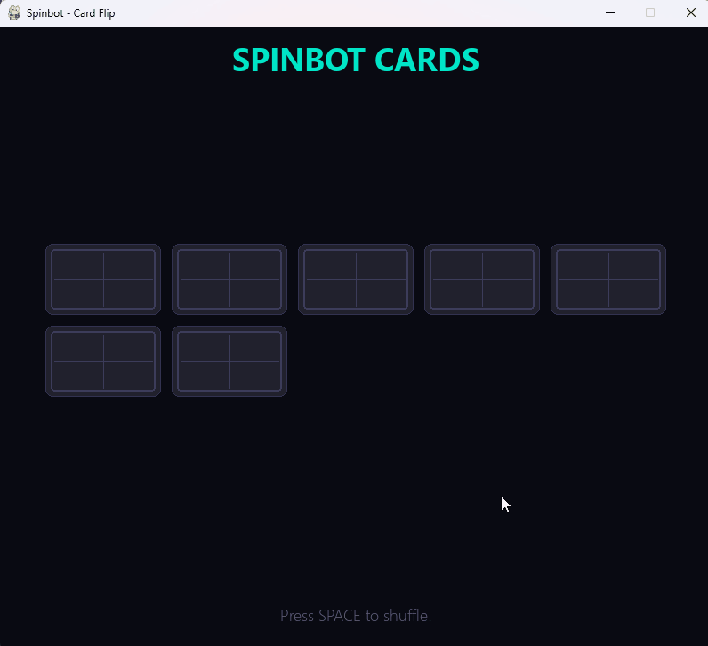
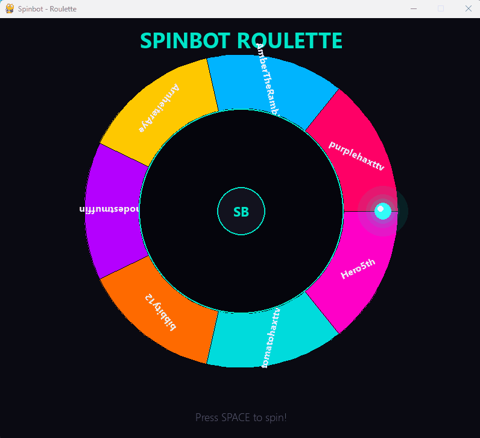
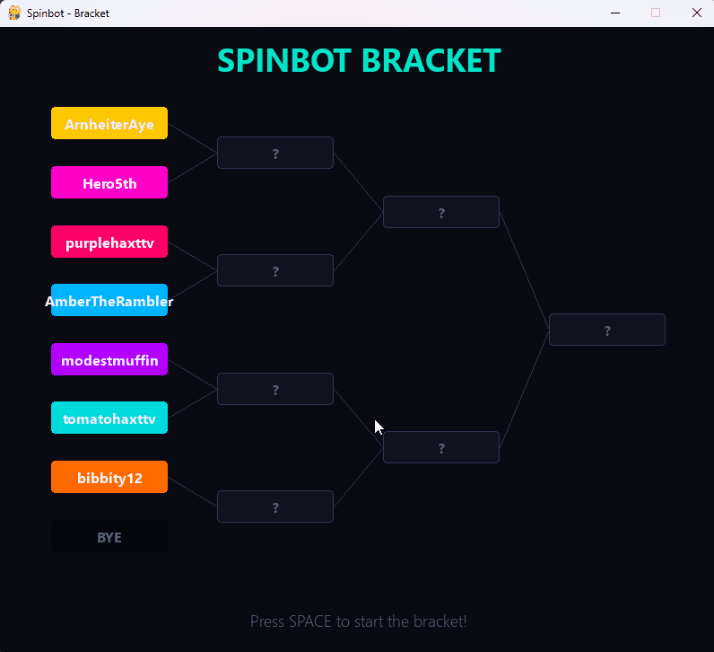
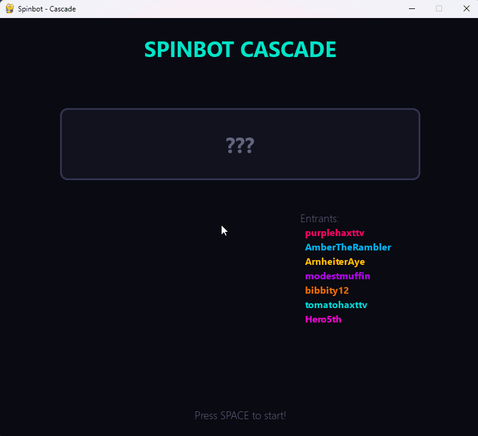
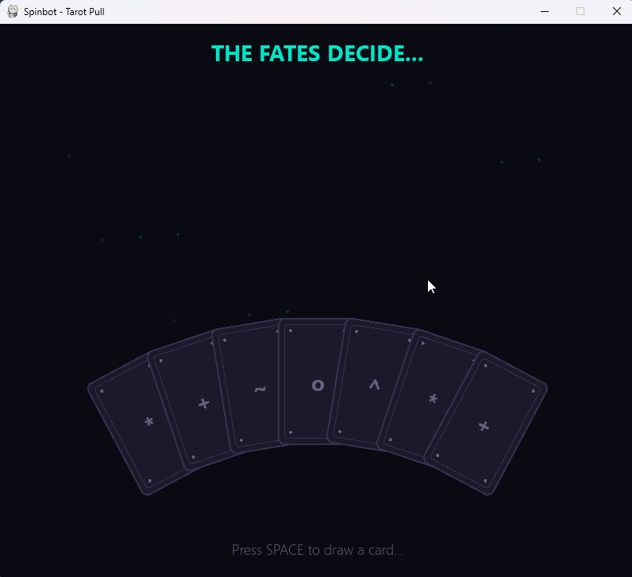
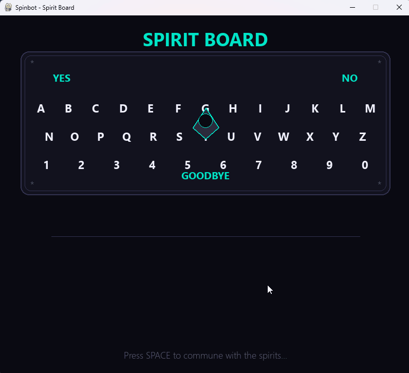

# Spinbot

A streamer giveaway tool with animated spinners. Supports both [Firebot](https://firebot.app) and [Streamer.bot](https://streamer.bot).

Spinbot pulls viewer check-in data from your bot platform and runs one of eight animated spinner types to pick a winner. The winner is automatically announced in your Twitch chat.

## Getting Started

### Requirements

One of the following bot platforms:

- **[Firebot](https://firebot.app)** installed and running (default: `localhost:7472`)
- **[Streamer.bot](https://streamer.bot)** installed and running with the WebSocket server enabled (default: `ws://127.0.0.1:8080/`)

Plus a currency, metadata key, or user global variable that tracks viewer check-ins.

### Download

Grab the latest `Spinbot.exe` from the [Releases](https://github.com/purplehaxttv-stream-org/Spinbot/releases) page. No installation required -- just download, run, and connect to your bot.

### First-Time Setup

On first launch, Spinbot walks you through configuration:

1. Choose how you track check-ins (Firebot currency or viewer metadata)
2. Select your check-in currency/key
3. Optionally add a bonus currency for first check-in rewards
4. Pick a spinner, choose your odds mode, and go


Settings are saved to `~/.spinbot/config.json` and persist between sessions. Reconfigure any time from the main menu.

## Features

- Supports both **Firebot** and **Streamer.bot**
- 8 animated spinner types
- 3 odds modes: weighted visible, weighted hidden, and pure random
- 5 color themes plus custom theme support
- Winner announced in Twitch chat automatically
- Persistent configuration saved between sessions

## Spinners

### Wheel
Classic prize wheel that spins and decelerates to a stop.



### Slot Machine
Three reels scroll through names and lock into place one by one.



### Card Flip
Cards shuffle, eliminate one by one, and the last card flips to reveal the winner.



### Roulette
A glowing ball spins around a roulette track and settles on a name.



### Bracket
Single-elimination tournament bracket reveals round by round.



### Name Cascade
Names cycle rapidly and decelerate until landing on the winner.



### Tarot Pull
Cards fan out, one is drawn from the spread and flipped to reveal the chosen viewer.



### Spirit Board
A planchette glides across a spirit board, spelling out the winner letter by letter.



## Themes

Switch themes from the main menu at any time. Your selection is remembered across sessions.

- **Dark** (default)
- **Midnight Blue**
- **Ember**
- **Void**
- **Neon**
- **Custom** -- build your own with hex colors

## Odds Modes

| Mode | Description |
|------|-------------|
| **Weighted (visible)** | Viewers with more check-ins have proportionally larger slices/slots |
| **Weighted (hidden)** | Odds are weighted but visually equal -- keeps it suspenseful |
| **Pure random** | Every entrant has an equal chance regardless of check-ins |

## Roadmap

See [TODO.md](TODO.md) for planned features including `!enter` command support and more.

## Building from Source

For developers or contributors who want to run from source:

```
git clone https://github.com/purplehaxttv-stream-org/Spinbot.git
cd Spinbot

python -m venv .venv
.venv\Scripts\activate

pip install -r requirements.txt
python main.py
```

Requires **Python 3.14+** and **Windows**. Dependencies: `pygame-ce`, `requests`, `websocket-client`.

To build the exe yourself:

```
pip install pyinstaller
pyinstaller --onefile --noconsole --name Spinbot main.py
```

The exe will be in the `dist/` folder.

## License

MIT
